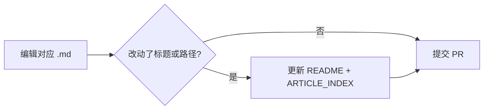

# 用户文档维护工作流

面向**站长、贡献者、维护者**：如何在仓库内正确新增、修改、排序 NotionNext 使用说明。

> 策略总纲：[DOCUMENTATION_POLICY.md](../DOCUMENTATION_POLICY.md)  
> 读者导航：[README.md](./README.md) · 官方 slug 对照：[ARTICLE_INDEX.md](./ARTICLE_INDEX.md)

---

## 一、维护者先记住的三件事

1. **权威位置**：站长向教程在 `docs/user-guide/`（主题统一在 `user-guide/themes/<id>.md`）；`docs/themes/` 仅放开发者深度文档，不要只改 [docs.tangly1024.com](https://docs.tangly1024.com/about)。
2. **三处必同步**：改一篇教程时，视情况更新 **正文**、**README 目录**、**ARTICLE_INDEX**（新建或废弃时还要动 **MIGRATION_STATUS**）。
3. **与代码一致**：环境变量名、配置键、默认值以 `conf/*.config.js`、`blog.config.js`、各主题 `themes/*/config.js` 为准；版本号以 `package.json` 为准。

---

## 二、文档放在哪（目录秩序）

| 你要写的内容 | 目录 | 文件名习惯 |
| --- | --- | --- |
| 建站介绍、总流程 | `docs/user-guide/` 根目录 | `intro.md`、`deploy-vercel.md` 等短名 |
| 部署 / 域名 / 平台 | `docs/user-guide/deploy/` | `平台或主题.md`，如 `netlify.md` |
| 站点配置、URL、搜索 | `docs/user-guide/config/` | 功能名，如 `url-customize.md` |
| Notion 使用技巧 | `docs/user-guide/notion/` | |
| 版本与更新说明 | `docs/user-guide/changelog/` | |
| 主题（站长向） | `docs/user-guide/themes/<id>.md` | 25 篇；`generate-theme-user-docs.mjs` 刷新配置表；Proxio/Heo 含合并专题 |
| 主题（开发向） | `docs/themes/` | 仅 Claude、Endspace 等全局改动长篇；勿与站长文重复 |
| 4.9.x 配置 / Notion 能力 | `docs/user-guide/reference/` | `features.md`、`notion-4x.md`（改 `conf/` 后必同步） |
| 统计 / 评论 / 挂件 | `analytics/`、`comments/`、`plugins/` | 一篇一插件或一总览 |
| 开发、架构 | `docs/user-guide/development/` + `docs/GETTING_STARTED.md` 等 | 用户向写短，细节放 `docs/` |
| 运营、SEO | `docs/user-guide/operations/` | |
| 社群、反馈、赞助 | `docs/user-guide/help/` | |

**不要**把站长教程写进 `docs/ARCHITECTURE.md`；**不要**把架构细节塞进 `user-guide` 除非有「站长也需要知道」的简短说明并链到开发者文档。

---

## 三、读者阅读顺序（维护时不要打乱）

`README.md` 里 **「快速开始」** 的 1→6 步是推荐路径，新增总览类文章时不要插在这 6 步中间，除非确实属于入门必经步骤。

推荐读者路径：

```text
intro → deploy-vercel → notion-database → config-site → menu-secondary → update
```

栏目内顺序（`README.md` 各小节）建议保持：

```text
部署 → Notion → 配置扩展 → 主题 → 统计/评论/插件 → 开发/运营 → 帮助 → 更新日志
```

---

## 四、标准工作流（按场景）

### 场景 A：修正错别字 / 更新步骤（小改）



1. 找到 [ARTICLE_INDEX.md](./ARTICLE_INDEX.md) 中的本地路径。  
2. 修改正文；保留文首 `> 迁移自：`（若原本有）与文末 **原文链接**（若仍对应源站）。  
3. `yarn` 无需跑；文档 PR 建议 `docs(user-guide): 说明` 类 commit。  
4. PR 描述写清：改了什么、是否已与当前 `main` 配置一致。

### 场景 B：新增一篇站长教程

1. **定目录**：按 [第二节](#二文档放在哪目录秩序) 选子目录，文件名用 **小写英文 + 连字符**，如 `deploy/xxx.md`。  
2. **写正文模板**（复制后填空）：

```markdown
# 标题

> 迁移自：[源站标题](https://docs.tangly1024.com/article/slug) · 最后同步：YYYY-MM

（正文：步骤用有序列表；配置用表格；命令用代码块）

## 相关

- 链到本仓库其它文档

## 原文链接

https://docs.tangly1024.com/article/slug
```

3. **更新导航（必做）**  
   - [README.md](./README.md)：在对应栏目下增加一条链接。  
   - [ARTICLE_INDEX.md](./ARTICLE_INDEX.md)：增加一行 `slug | 本地路径`。  
   - [MIGRATION_STATUS.md](./MIGRATION_STATUS.md)：若从「待迁移」变为已迁移，改状态表。  
4. **交叉引用**：若涉及环境变量，在正文注明 `NEXT_PUBLIC_*` 与 `conf/*.config.js` 中的键名。  
5. **提 PR**：标题建议 `docs(user-guide): add <主题>`；说明是否对应旧站某 slug。

### 场景 C：代码新增配置项 / 功能

与功能 PR **同一 PR** 或 **紧跟的 docs PR** 中：

1. 在 `conf/*.config.js` 加注释时，可写 `参阅 docs/user-guide/...`。  
2. 在 `user-guide` 中更新对应插件/配置文档（或 `config-site.md` / `config/site-basics.md`）。  
3. 若影响升级路径，同步 [update.md](./update.md) 或 [changelog/latest.md](./changelog/latest.md)。  
4. 破坏性变更必须在 changelog 与文档中**显眼注明**。

### 场景 D：主题新增或主题配置大改

1. 站长向：在 `docs/user-guide/themes/<id>.md` 维护（运行 `node scripts/generate-theme-user-docs.mjs` 刷新配置表）。
2. 仅当主题涉及全局文件 / 架构：在 `docs/themes/` 增补开发者文档，并在 `<id>.md` 中加「开发者深度文档」链接（勿重复站长正文）。
3. 更新 [themes/overview.md](./themes/overview.md) 主题列表（与 `themes/` 目录实际文件夹一致）。  
4. 更新 [ARTICLE_INDEX.md](./ARTICLE_INDEX.md)。

### 场景 E：废弃或仅保留外链

1. 正文顶部加说明：`> 已废弃：请使用 …`  
2. 不要删除文件时留下死链：全文搜索仓库内指向该文件的路径。  
3. `ARTICLE_INDEX` 移到「仅链到源站」或删除行并注明原因。  
4. `README` 中移除或改为「已归档（见 xxx）」。

---

## 五、提交前检查清单（Checklist）

复制到 PR 描述或自检：

```markdown
- [ ] 路径符合 docs/user-guide/ 目录约定
- [ ] README.md 已增加/调整链接
- [ ] ARTICLE_INDEX.md 已更新（新 slug / 新路径）
- [ ] 无 .env、Token、个人域名 ID、真实 API Key 示例
- [ ] 环境变量名与 conf/*.config.js 一致
- [ ] 版本号与 package.json / Releases 一致（若提到版本）
- [ ] 保留或更新了「原文链接」（若源自 tangly1024 文档站）
- [ ] 站内相对链接可点击（`./` 或 `../`）
- [ ] 未把开发者长篇文档重复粘贴到 user-guide
```

---

## 六、注意事项（常见错误）

### 内容与安全

| 禁止 | 建议 |
| --- | --- |
| 提交真实 `NOTION_PAGE_ID`、Token、私钥 | 用 `your-xxx`、`示例` |
| 写死已失效的第三方 URL | 链到官方文档，步骤写「以控制台为准」 |
| 与 `main` 分支配置键不一致 | 改文档前打开对应 `conf/*.config.js` 核对 |

### 结构与链接

- **一篇一主题**：评论插件拆在 `comments/`，不要全部堆进一篇（除非做总览 + 子链）。  
- **总览 + 分篇**：`overview.md` 只写对比表和链接，细节在子页面。  
- **勿重复主题正文**：每个主题只维护一篇站长文档 `user-guide/themes/<id>.md`；`docs/themes/PROXIO.md`、`HEO.md` 仅为重定向存根。  
- **changelog**：超长历史放 [changelog/v4-history.md](./changelog/v4-history.md) + GitHub Releases，不要在 `user-guide` 根目录贴几千行日志。

### 与旧站关系

- 过渡期保留 **原文链接**，方便对照截图。  
- 本仓库为准：与源站冲突时，以 **本仓库 `main` + 当前代码** 为准，并在 PR 中说明。  
- 不要批量删除「迁移自」行，除非该文已为仓库原创、与源站无关。

### PR 与协作

- 文档专用分支：`docs/xxx` 或 `docs/user-guide-xxx`。  
- 文档与功能分 PR 时，在功能 PR 中写 `Docs follow-up: #xxx`。  
- 遵循 [CONTRIBUTION_WORKFLOW.md](../CONTRIBUTION_WORKFLOW.md)（lint/test 对纯文档 PR 可选，但勿改无关文件）。

---

## 七、发布与后续（可选）

- 静态站规划见 [WEBSITE.md](./WEBSITE.md)（VitePress / Nextra）。  
- 发版时：检查 [changelog/latest.md](./changelog/latest.md) 是否指向当前 `package.json` version。  
- Fork 用户：README 已指向 `docs/user-guide/`，他们合并 upstream 即可获得文档更新。

---

## 八、一分钟决策表

| 我想… | 去做 |
| --- | --- |
| 改部署步骤 | `deploy/*.md` + README |
| 改评论/统计配置说明 | `comments/` 或 `analytics/` + 核对 `conf/` |
| 改 Proxio 顶栏 | `docs/user-guide/themes/proxio.md` |
| 改开发环境 | `docs/GETTING_STARTED.md`，user-guide 只保留链接 |
| 不知道写哪 | 查 [ARTICLE_INDEX.md](./ARTICLE_INDEX.md) |
| 新功能无文档 | 场景 B + C |

---

## English summary

Maintain end-user docs under `docs/user-guide/`. On every add/change: update the article, `README.md`, and `ARTICLE_INDEX.md`. Match env var names to `conf/*.config.js`. Never commit secrets. Use the checklists in Section 5 before opening a PR.
